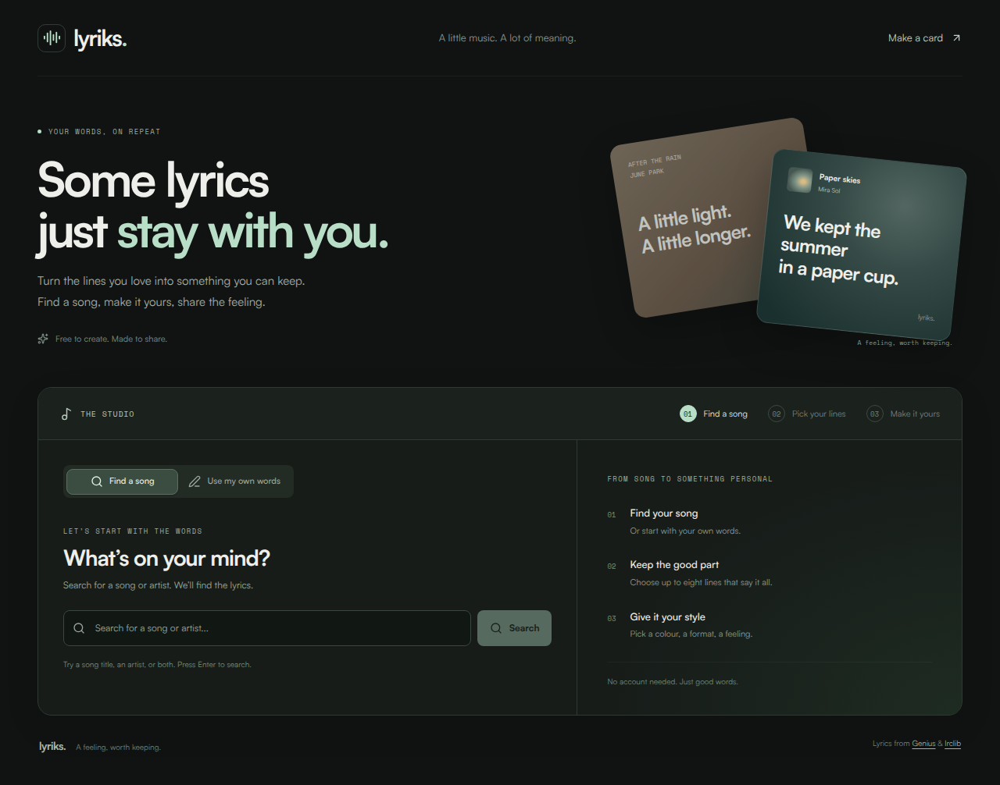
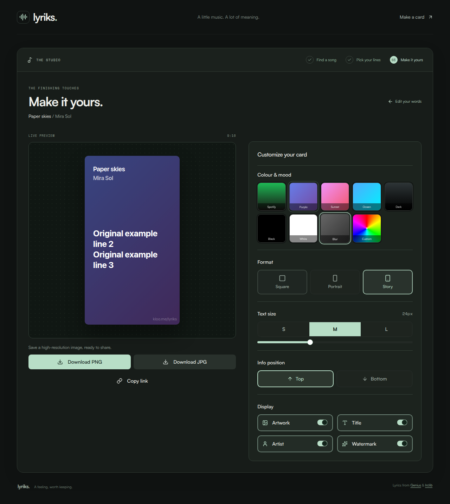

<div align="center">

# Lyriks

**Turn the lyrics you love into something worth keeping.**

Create personalised lyrics cards, tune their look, and share them as high-resolution images or editable links.

[Try Lyriks](https://lyriks-pied.vercel.app) · [Report a bug](https://github.com/meschack/lyriks/issues/new?template=bug_report.yml) · [Suggest an idea](https://github.com/meschack/lyriks/issues/new?template=feature_request.yml)

[](LICENSE)
[](frontend/package.json)
[](CONTRIBUTING.md)

</div>



## What you can make

- **Song lyrics cards.** Find a song through Genius, fetch its lyrics from lrclib, and select a passage of up to eight lines.
- **Cards with your own words.** Paste lyrics, a quote, or original text, then add a title, author and optional artwork.
- **A look that fits the words.** Choose from nine themes, including blurred artwork and a custom colour. Adjust text size, metadata placement and visible details.
- **The right shape.** Square (1:1), portrait (4:5), or story (9:16).
- **Something ready to share.** Download a high-resolution PNG or JPG, or copy a link that preserves the card's content and settings.

The studio shows a live preview, keeps your selection when you return to edit it, and remembers your styling preferences in your browser. It works on desktop and mobile, without an account.

<details>
<summary>See the card editor</summary>



The screenshots use sample content to illustrate the interface.

</details>

## Run locally

### Requirements

- Node.js 20 or later and pnpm
- Python 3.12 or later
- Redis, or Docker Compose to run the included Redis service
- A [Genius access token](https://genius.com/api-clients) for song search

You can use the **own words** mode with only the frontend running. Song search and lyrics retrieval require the backend.

### 1. Clone and configure

```bash
git clone https://github.com/meschack/lyriks.git
cd lyriks
cp backend/.env.example backend/.env
cp frontend/.env.example frontend/.env
```

Set `GENIUS_ACCESS_TOKEN` in `backend/.env`. The frontend defaults to `http://localhost:8000` for the backend. The Spotify credentials in the example file are optional; current song search uses Genius.

### 2. Start Redis and the backend

From the repository root:

```bash
docker compose -f docker/docker-compose.yml up -d redis
cd backend
python3 -m venv venv
source venv/bin/activate
python -m pip install -r requirements.txt
uvicorn app.main:app --reload --port 8000
```

On Windows, activate the environment with `venv\Scripts\activate`.

### 3. Start the frontend

In another terminal, from the repository root:

```bash
cd frontend
pnpm install
pnpm dev
```

Open [localhost:3000](http://localhost:3000). Backend API documentation is available at [localhost:8000/docs](http://localhost:8000/docs).

## How it works

| Part | Tools | Responsibility |
| --- | --- | --- |
| Frontend | Next.js 15, React 19, TypeScript, Tailwind CSS 4, shadcn/ui | Search, selection, custom text and the card editor |
| Client state | TanStack Query, nuqs | API caching and shareable URL state |
| Image export | Satori, Sharp | Server-rendered PNG and JPG images |
| Backend | FastAPI, Pydantic, httpx | Song search, lyrics retrieval and image utilities |
| Cache | Redis | Cache search and lyrics responses |
| Sources | Genius, lrclib | Song metadata and lyrics |

```text
lyriks/
├── frontend/       Next.js application and image export API
├── backend/        FastAPI application and tests
├── docker/         Docker Compose services
├── docs/           Screenshots and design explorations
└── Makefile        Development commands
```

### Useful checks

```bash
# Frontend, from frontend/
pnpm lint
pnpm exec tsc --noEmit
pnpm build

# Backend, from backend/ with the virtual environment active
pytest
```

## Contribute

Bug reports, improvements and documentation fixes are welcome. Read the [contribution guide](CONTRIBUTING.md), browse [open issues](https://github.com/meschack/lyriks/issues), or use the issue templates above.

## License and credits

Lyriks project code is distributed under the [MIT License](LICENSE). Third-party fonts, artwork and lyrics remain subject to their own licences and rights.

Thanks to [Genius](https://genius.com), [lrclib](https://lrclib.net), [shadcn/ui](https://ui.shadcn.com) and [Satori](https://github.com/vercel/satori) for the tools and data behind the studio.
